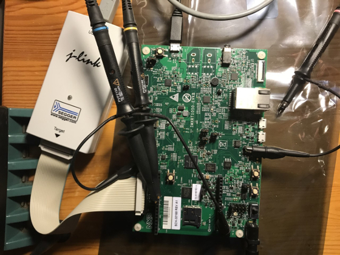

# evkbimxrt1050

## General
Exploring the NXP i.MX RT series crossover MCUs by using the i.MX RT1050 EVK development board.

## Dependencies
All applications have been built and tested with:

* Linux Mint 19 Tara (x86_64)
* MCUXpresso IDE, v11.0.1 [Build 2563] [2019-09-01]
* SEGGER J-Link EDU, V6.55a

## Overview
Development board and J-Link debugger.

